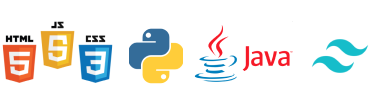

# Introduction 🙋‍♂️👨‍💻
Hii, This is Belal Ahmed Here!

I started to code when I was 11, There I learned How to build Websites Using Pure HTML, CSS, JavaScript & Python. After sometime I got into Tkinter with Python and from that, spent an entire year writing Desktop Graphical User Interface Applications with Tkinter.

I always like to learn new technologies, I am learning Android Development With Java As Of Now

## Languages & Frameworks I Know 💻☕

These are the Languages and Frameworks I know 
    
 - [Python](https://en.wikipedia.org/wiki/Python_(programming_language))
 - [Java](https://en.wikipedia.org/wiki/Java_(programming_language))
 - [HTML](https://en.wikipedia.org/wiki/HTML)
 - [CSS](https://en.wikipedia.org/wiki/CSS)
 - [JavaScript](https://en.wikipedia.org/wiki/JavaScript)
 - [Tkinter](https://en.wikipedia.org/wiki/Tkinter)
 - [Tailwind CSS](https://tailwindcss.com/)

## Code Editors, Integrated Development Environments and Tools I Use 🛠

## How to Contact Me? 📞

You can contact me by sending me a direct message on [Instagram](https://www.instagram.com/)

[My Instagram Account](https://instagram.com/mrbelalahmed95)

Or you can also contact me by sending me an Email

Email I'd - `belalahmed7651@gmail.com`

<!---
mrbelalahmed95/mrbelalahmed95 is a ✨ special ✨ repository because its `README.md` (this file) appears on your GitHub profile.
You can click the Preview link to take a look at your changes.
--->
